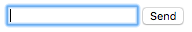
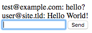
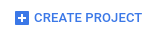
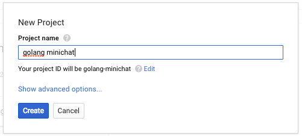

# Go Minichat

Minimal chat example using go on App Engine.

Deployed at <https://go-minichat.appspot.com/>

### 1. Create Go Backend Application

In your project directory create an `app.yaml` file with the following contents:

```yaml
runtime: go
api_version: go1

handlers:
- url: /static
  static_dir: static
- url: /.*
  script: server.app
- url: /_ah/channel/disconnected/
  script: server.app

inbound_services:
- channel_presence
```

Create a `server.go` file. This will be where the code for your backend go
application lives. The first it needs to do is set up the imports and initialize
the web framework.

```go
package minichat

import (
	"net/http"

	"appengine"
)

func init() {
	http.HandleFunc("/", index)
}

func index(w http.ResponseWriter, r *http.Request) {
  // TODO
}
```

Next we need to add the logic to render the main index page:

```go
func index(w http.ResponseWriter, r *http.Request) {
	c := appengine.NewContext(r)
	u := user.Current(c)
	// Check if user is logged in
	if u != nil {
		// Create unique chat channel for user and save to active list
		token, err := channel.Create(c, u.ID)
		if err != nil {
			http.Error(w, err.Error(), http.StatusInternalServerError)
			return
		}
		// Add user to active users
		a := ActiveUser{
			Userid: u.ID,
		}
		key := datastore.NewKey(c, "ActiveUser", u.ID, 0, nil)
		_, err = datastore.Put(c, key, &a)
		if err != nil {
			http.Error(w, err.Error(), http.StatusInternalServerError)
			return
		}
		if err := indexTemplate.Execute(w, token); err != nil {
			http.Error(w, err.Error(), http.StatusInternalServerError)
		}
	}
}

var indexTemplate = template.Must(template.New("index").Parse(`
<!DOCTYPE html>
<div id="messages"></div>
<form id="message-form">
  <input type="text" id="message">
  <button type="submit">Send</button>
</form>
<script src="/_ah/channel/jsapi"></script>
<script>
  window.channel = new goog.appengine.Channel('{{.}}');
</script>
<script src="/static/main.js"></script>
`))
```

Notice that we are defining our index html contents in our backend code. With a
larger html page we would want to keep this in a separate file. But since this
is only a small amount a html it's relatively harmless here. Try researching how
to load it from an `index.html` file.

Now we need to add imports for the libaries used in our `index` handler
function. Update `import` at the top of the file with:

```go
import (
	"html/template"
	"net/http"

	"appengine"
	"appengine/channel"
	"appengine/datastore"
	"appengine/user"
)
```

Finally note that the `ActiveUser` reference used that wasn't
defined or imported.  Let's define it! Before `func index` add:

```go
type ActiveUser struct {
	Userid string
}
```

This will help keep track of users currently chatting on our site by storing
them in the App Engine datastore.

Now our app needs a handler for the site to actually send chats to. When a user
send a chat to the backend this handler will send out that message to each
currently active user.

```go
func chat(w http.ResponseWriter, r *http.Request) {
	c := appengine.NewContext(r)
	u := user.Current(c)
	if r.Body != nil {
		message, err := ioutil.ReadAll(r.Body)
		if err != nil {
			http.Error(w, err.Error(), http.StatusInternalServerError)
			return
		}
		fmt_msg := fmt.Sprintf("%v: %v", u.String(), string(message))
		var actives []ActiveUser
		_, err = datastore.NewQuery("ActiveUser").GetAll(c, &actives)
		for _, active := range actives {
			channel.Send(c, active.Userid, fmt_msg)
		}
	}
}
```

Register the url for this handler in the `init` function.

```go
func init() {
	http.HandleFunc("/", index)
	http.HandleFunc("/chat", chat)
}
```

And add the imports for the additional libraries used in the `chat` function:

```go
import (
	"fmt"
	"html/template"
	"io/ioutil"
	"net/http"

	"appengine"
	"appengine/channel"
	"appengine/datastore"
	"appengine/user"
)
```

Almost done with the backend, just one more handler. Note that the app adds
`ActiveUsers` when they load the site but never removes them. So our app isn't
trying to send chat messages to long gone users we need to add a disconnect
handler.

```go
func disconnect(w http.ResponseWriter, r *http.Request) {
	c := appengine.NewContext(r)
	userid := r.FormValue("from")
	if userid != "" {
		key := datastore.NewKey(c, "ActiveUser", userid, 0, nil)
		err := datastore.Delete(c, key)
		if err != nil {
			http.Error(w, err.Error(), http.StatusInternalServerError)
		}
	}
}
```

And add the disconnect url that App Engine uses to notify our app that a user
disconnected from our channel.

```go
func init() {
	http.HandleFunc("/", index)
	http.HandleFunc("/chat", chat)
	http.HandleFunc("/_ah/channel/disconnected/", disconnect)
}
```

### 2. Create JavaScript for the Frontend Application

Now we need to write the JavaScript to send and receive chat messages. Create a
folder `static` in the project directory then a file in that folder `main.js`.

The first thing to do is create a `Chat` class and bind to the html elements
from `index.html` and open a connection to the go backend.

```js
// Initializes Chat
function Chat() {
  // Shortcuts to DOM Elements.
  this.messageList = document.getElementById('messages');
  this.messageForm = document.getElementById('message-form');
  this.messageInput = document.getElementById('message');

  // Saves message on form submit.
  this.messageForm.addEventListener('submit', this.saveMessage.bind(this));

  // Focus on the input
  this.messageInput.focus();

  // Open Channel connection.
  window.channel.open({
    onopen: function(){},
    onerror: function(){},
    onclose: function(){},
    onmessage: this.displayMessage.bind(this)
  });
}

window.onload = function() {
  new Chat();
};
```

When opening the connection we have the option to specify functions to be called
when other events occur on the channel connection such as a disconnect or an
error. We only need to concern ourselves with the `onmessage` function but feel
free to add `console.log` statements to the other functions to see when they
might be called.

Now there are two functions referenced in the initialization code that need to
be defined `saveMessage` and `displayMessage`. Let's start with displaying a
message.

```js
// Displays a Message in the UI.
Chat.prototype.displayMessage = function(message) {
  var msg = document.createElement('div');
  msg.innerHTML = message.data;
  this.messageList.appendChild(msg);
};
```

This function uses the channel connection to receive the message data from the
backend.

In order to send a message to the backend we will have to open a new connection.

```js
// Sends user's message to the backend
Chat.prototype.saveMessage = function(e) {
  e.preventDefault();
  // Check that the user entered a message.
  if (this.messageInput.value) {
    // Post message to ChatHandler
    var xhr = new XMLHttpRequest();
    xhr.open('POST', '/chat', true);
    xhr.send(this.messageInput.value);
    // Clear message text field and focus on it.
    this.messageInput.value = '';
    this.messageInput.focus();
  }
};
```

### 3. Test locally

Download and install the App Engine Go SDK from
<https://cloud.google.com/appengine/docs/go/download>

In the project directory run this command to test your project on your machine:

```
dev_appserver.py .
```

You should see something like this when you go to <http://localhost:8080>



Try opening the page in an incognito window to chat as a new user.



### 4. Deploy to App Engine

Go to <https://console.cloud.google.com> and click on CREATE PROJECT



Choose a project name for your project:



Install the Google Cloud Tools from here <https://cloud.google.com/sdk/docs/>

Once installed run

    gcloud init

Login and select the project you just created.

To deploy your app and make it publicly available run

```
gcloud app deploy
```
